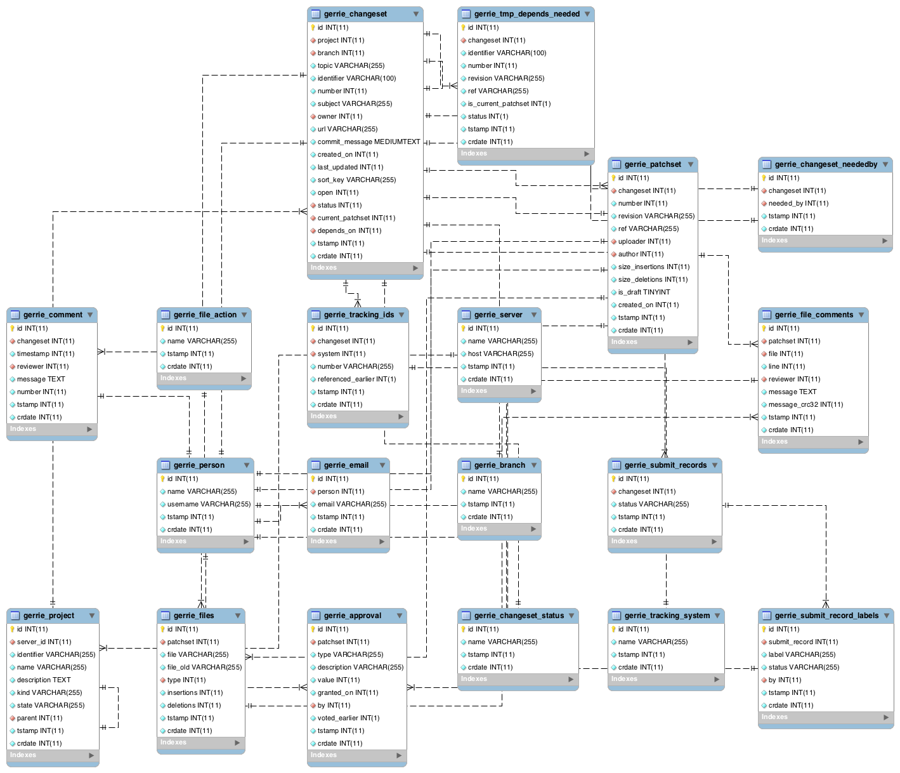

Database
###############

Supported databases
=====================
Currently *Gerrie* supports only `MySQL`_.

.. note::

    You want to support another database like PostgreSQL or a NoSQL database?
    Feel free to :doc:`contribute</contributing/index>`. This is _very_ welcome!

Setup the schema
=====================
To setup the schema the database itselfs has to be exists.
Please create this database before using *Gerrie*.
A command can look like

.. sourcecode:: sql

        CREATE DATABASE gerrie;

Based upon this you can create the database schema.
The :doc:`gerrie:setup-database command</commands/setup_database>` will help you to setup the database schema.

Schema
=======
To query the database and answer questions based on this data it is important that you will understand how the data is structured.
MySQL is a typical RDBMS.
So we use a typical table / column schema to reflect the complex data structure of Gerrit.
Below you will find a visualisation of the database scheme as entity relationship model.

This entity relationship model was created with `MySQLWorkbench`_.
If you want to get a deeper look at this schema to investigate it, you can install MySQLWorkbench and load the source file `eer-diagram.mwb`_.

.. _MySQL: http://www.mysql.com/
.. _MySQLWorkbench: http://www.mysql.com/products/workbench/
.. _eer-diagram.mwb: https://github.com/andygrunwald/Gerrie/raw/master/docs/database/EER-Diagram.mwb